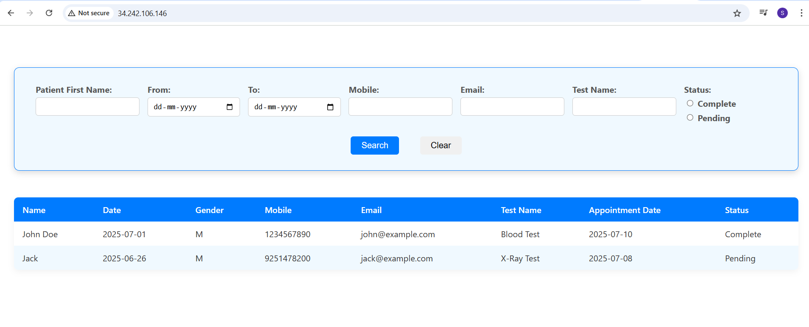

# Automated Container Deployment and Administration in the Cloud

## Automated HealthCare App Deployment on Azure using AWS CloudFormation, EC2 instance, Ansible, Docker & GitHub Actions.

This project can be used to exhibit the end-to-end automation of cloud infrastructure provisioning and deployment of applications with the help of Docker. The Java/JS application will be hosted on an AWS with configuration and deployment process completely automated with:
• AWS CloudFormation for cloud infrastructure.
• Ansible used for server setup configuration and Docker deployment, which configures the EC2 instances and Docker containers.
• Docker to containerize the Java/JS application
• GitHub Actions for CI/CD workflows.
## Tools
• AWS CloudFormation, EC2 instance, Elastic Container Registry for repository.
• Ansible
• Docker
• GitHub Actions

Excution steps:
Step 1: Code push to github
 - Code commited to github repository 
 - A GitHub Actions workflow will automatically triggered due to 
		on:
		 push:
			branches: [ "main" ] by pushing the code on main.
Step 2: Docker image to AWS Elastic Container Registory.
- Github action triggered api-docker-build.yml and ui-docker-build.yml files for backend and frontend code. Created image via dockerImage.yml file pushed to ECR.
- With the help of AWS Credentials, authenticated to Amazon ECR
  This is for GitHub Actions to authenticate into AWS, which is required for ECR access with login into ECR.
	 - name: Configure AWS credentials
      uses: aws-actions/configure-aws-credentials@v2
      with:
        aws-access-key-id: ${{ secrets.AWS_ACCESS_KEY_ID  }}
        aws-secret-access-key: ${{ secrets.AWS_SECRET_ACCESS_KEY }}
        aws-region: eu-west-1 
    - name: Login to Amazon ECR
      id: login-ecr
      uses: aws-actions/amazon-ecr-login@v2	 
Step 3: CloudFormation	and launch EC2 instance using cloudFormation
- 1.To create stack :
aws cloudformation create-stack \
  --stack-name MyEC2Stack \
  --template-body file://Ec2WithDockerInstll.yaml \
  --parameters ParameterKey=KeyName,ParameterValue=srushti-ec2-keyPair \
  --capabilities CAPABILITY_NAMED_IAM  
  
- EC2WithDockerInstall yml file used for docker installation and docker compose via UserData
Step 4: Ansible to EC2 instance
- Defined ansible yml file which excuted by .gitHub/workflows
- inventory.yaml file contains EC2 instance's public IP 
 Triggered ansible file generated playBook file which will connected to server and performed some events such as:
 4.1 Installing required dependencies 
 4.2 Instaling with starting and ensuring Docker services.
 4.3  using docker pull, pull previous docker image.
 4.4 Run container with the help of docker compose yml file.
Step 5: Using AWS instance public IP, docker container runs on EC2 instance to run web application.

Visit EC2 public IP:
http://34.242.106.146/

